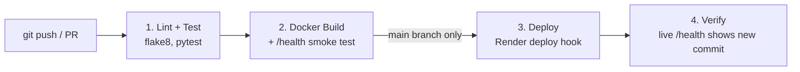

# Second Closet – A Second-Hand Clothing Marketplace


Second Closet is a small dynamic web application where people list pre-loved clothes for sale and buyers can mark items as sold. Every page is generated by the Flask server from live data. The app is delivered through **Git** and a **GitHub Actions CI/CD pipeline** that lints, tests, builds a Docker image and deploys to Render automatically.

- **Live site:** https://second-closet.onrender.com
- **Pipeline runs:** https://github.com/Varadh27/second-closet/actions

> CCA 2 – Cloud Computing and DevOps (CSE30040), MIT-WPU · Varadh Vairava · PRN 1262241985 · Panel B, Roll No. 32

## Features

| Feature | Route | Notes |
|---|---|---|
| Storefront (server-rendered) | `GET /` | Listings, available/sold counts, category filter (`?category=Tops`) |
| List an item (form) | `POST /items` | Validates name, seller, category, size, condition and price (Rs 1–50,000); returns **400** with error messages if invalid |
| Buy an item | `POST /items/<id>/buy` | Marks it **Sold**; **409** if already sold, **404** if it doesn't exist |
| JSON API | `GET /api/items` | Optional filters: `category`, `status`, `max_price` |
| Health check | `GET /health` | `{"status": "ok", "commit": "<sha>"}` |
| Commit footer | every page | Shows the running commit from `RENDER_GIT_COMMIT` |

Data is stored in memory, so it resets when the server restarts (a deliberate simplification for this project).

## Tech stack

Python 3.12 · Flask · Jinja2 templates · pytest · flake8 · Docker · GitHub Actions · Render (free tier) · gunicorn

## Run locally

```bash
git clone https://github.com/Varadh27/second-closet.git
cd second-closet
python3 -m venv venv
source venv/bin/activate          # Windows: venv\Scripts\activate
pip install -r requirements.txt

flake8 .                          # lint
pytest -v                         # tests
python app.py                     # open http://localhost:5000
```

Run with Docker:

```bash
docker build -t second-closet .
docker run -p 5000:5000 second-closet
```

## CI/CD pipeline



```
git push → Lint → Test → Docker Build → Deploy → Verify → Live site
```

| Stage | What happens | Runs on |
|---|---|---|
| 1. Lint and Test (CI) | Install dependencies, run flake8, run 11 pytest tests | Every push and pull request |
| 2. Build | Build the Docker image, start it, `curl /health` must succeed | Every push and pull request |
| 3. Deploy (CD) | POST to the Render deploy hook (stored as the `RENDER_DEPLOY_HOOK` secret) with `&ref=<commit>` | Push to `main` only |
| 4. Verify | Poll the live `/health` until it reports the new commit ID | After deploy |

Each job uses `needs:`, so if any stage fails, every later stage is skipped and broken code never reaches the live site. Render Auto-Deploy is **off**, so only the pipeline can deploy.

## Project structure

```
second-closet/
├── .github/workflows/ci-cd.yml   # pipeline
├── static/style.css
├── templates/index.html          # Jinja2 page
├── app.py                        # Flask app
├── test_app.py                   # pytest suite
├── Dockerfile
├── requirements.txt
├── setup.cfg                     # flake8 config
└── README.md
```

## Security notes

- The Render deploy hook URL is stored as a GitHub Secret, never in code.
- The Docker container runs as a non-root user.
